# 🔐 Distributor Login Setup Guide

## Overview
Distributor login is restricted to **MOBILE devices only**. This ensures that distributors can only access the app through the mobile application and cannot login on desktop browsers.

---

## 📱 Login Platforms

### **1. General Login** (All Roles)
- **Endpoint:** `POST http://localhost:8080/api/auth/login`
- **Supported On:** Mobile & Desktop (role-based validation)
- **Roles:** Admin, Super Admin, Users, etc.

### **2. Distributor Login** (DISTRIBUTOR Role Only)
- **Endpoint:** `POST http://localhost:8080/api/distributors/login`
- **Supported On:** **Mobile devices ONLY**
- **Blocked On:** Desktop browsers
- **Roles:** DISTRIBUTOR, SALES

### **3. Sales Login** (SALES Role Only)
- **Endpoint:** `POST http://localhost:8080/api/sales/login`
- **Supported On:** **Mobile devices ONLY**
- **Blocked On:** Desktop browsers
- **Roles:** SALES

---

## 🔄 Login Flow

### **Distributor Login Process (Mobile)**

```mermaid
graph TD
    A[User selects 'Distributor' mode] --> B[Enters credentials]
    B --> C[User is on MOBILE device?]
    C -->|YES| D[POST /api/distributors/login]
    C -->|NO| E[❌ Error: Mobile only]
    E --> F[Show error message]
    D --> G{Login successful?}
    G -->|YES| H[Store auth token]
    H --> I[Navigate to Dashboard]
    G -->|NO| J[Show error message]
    I --> K[Display Distributor Dashboard]
```



### **Distributor Login Process (Desktop) - BLOCKED**


---

## 🧪 Testing Distributor Login

### **Test Case 1: Distributor Login on Mobile (SUCCESS)**

**Expected Behavior:** Login succeeds

```bash
# Curl command (simulating mobile app)
curl -X 'POST' \
  'http://localhost:8080/api/distributors/login' \
  -H 'accept: */*' \
  -H 'Content-Type: application/json' \
  -d '{
  "username": "johndoe1234",
  "password": "SecurePass123!"
}'
```

**Response (Success):**
```json
{
  "token": "eyJ...",
  "type": "Bearer",
  "username": "johndoe1234",
  "userId": 123,
  "roleType": "DISTRIBUTOR",
  "message": "Login successful",
  "features": [...],
  "featureNames": [...]
}
```

**Frontend Flow:**
1. ✅ Mobile device detected
2. ✅ Credentials sent to `/api/distributors/login`
3. ✅ Response includes roleType: "DISTRIBUTOR"
4. ✅ Token stored in localStorage
5. ✅ Navigate to Dashboard (Distributor View)

---

### **Test Case 2: Distributor Login on Desktop (FAILURE)**

**Expected Behavior:** Login blocked with clear error message

**UI Action:**
1. User selects "Distributor" login type
2. User is on desktop/browser
3. Enters credentials and clicks "Sign In"
4. **ERROR THROWN:** "Distributor login is only available on mobile devices. Please use the mobile app to login."

**Frontend Flow:**
1. ❌ Desktop device detected
2. ❌ `distributorLogin()` throws Error
3. ❌ No API call is made
4. ❌ User sees error: "Distributor login is only available on mobile devices..."
5. ❌ Login blocked

---

### **Test Case 3: General Login with Distributor Account on Desktop (ALSO FAILS)**

If a user tries to use the "General" login with a distributor username on desktop:

```bash
curl -X 'POST' \
  'http://localhost:8080/api/auth/login' \
  -H 'accept: */*' \
  -H 'Content-Type: application/json' \
  -d '{
  "username": "johndoe1234",
  "password": "SecurePass123!"
}'
```

**Frontend Response:**
1. ✅ Generic login endpoint called
2. ✅ Credentials authenticated
3. ✅ Backend returns: `roleType: "DISTRIBUTOR"`
4. ❌ Frontend platform check: `canLoginOnCurrentPlatform("DISTRIBUTOR")`
5. ❌ Check fails (DISTRIBUTOR role on desktop)
6. ❌ Token cleared and user sees: "DISTRIBUTOR users can only login on mobile devices. Please switch to the mobile app."

---

## 📋 Authentication Service Methods

### **distributorLogin(username, password)**
```typescript
distributorLogin(username: string, password: string): Observable<LoginResponse>
```
- **Mobile Check:** YES ⚠️ (Throws error if desktop)
- **Endpoint:** `/api/distributors/login`
- **Valid Roles:** DISTRIBUTOR
- **Use When:** Distributor selects "Distributor" mode on mobile

### **salesLogin(username, password)**
```typescript
salesLogin(username: string, password: string): Observable<LoginResponse>
```
- **Mobile Check:** YES ⚠️ (Throws error if desktop)
- **Endpoint:** `/api/sales/login`
- **Valid Roles:** SALES
- **Use When:** Sales user selects "Distributor" mode on mobile

### **login(username, password)** - Generic
```typescript
login(username: string, password: string): Observable<LoginResponse>
```
- **Mobile Check:** NO (Validates after response)
- **Endpoint:** `/api/auth/login`
- **Valid Roles:** All roles (ADMIN, USER, etc.)
- **Post-Login Validation:** Platform check based on returned roleType
- **Use When:** General login selected OR any user role

---

## 🛡️ Validation Layers

### **Layer 1: Frontend (Ionic App)**
- Platform detection (iOS, Android, Desktop)
- Pre-flight validation before API call
- Early rejection with user-friendly messages

### **Layer 2: Backend (API)**
- Verify user credentials
- Check role type
- Validate device/platform headers if available
- Return role information to frontend

### **Layer 3: Token Storage**
- Store auth token in localStorage
- Include platform context in session
- Validate on app resume/refresh

---

## 🧬 Implementation Details

### **Platform Detection**
```typescript
isMobileDevice(): boolean {
  return this.platform.is('android') || this.platform.is('ios');
}

isDesktopDevice(): boolean {
  return this.platform.is('desktop') || 
         (!this.platform.is('android') && !this.platform.is('ios'));
}
```

### **Role-Based Validation**
```typescript
canLoginOnCurrentPlatform(roleType: string): boolean {
  // DISTRIBUTOR and SALES require mobile
  if ((role === 'DISTRIBUTOR' || role === 'SALES') && isMobile) {
    return true;
  }
  // ADMIN and SUPER_ADMIN can use both
  if (role === 'ADMIN' || role === 'SUPER_ADMIN') {
    return true;
  }
  // Regular users require desktop
  if (!isMobile && (role === 'USER' || role === 'MANAGER')) {
    return true;
  }
  return false;
}
```

---

## 📱 UI Components Updates

### **Login Page Enhancements**
- ✅ Login type selector (General / Distributor)
- ✅ Mobile-only warning banner for Distributor mode
- ✅ Dynamic button highlighting based on selection
- ✅ Enhanced error messages

### **Login Form**
```html
<!-- LOGIN TYPE SELECTOR -->
<button (click)="userType = 'distributor'">Distributor</button>
<button (click)="userType = 'general'">General</button>

<!-- DISTRIBUTOR MODE WARNING -->
<div *ngIf="userType === 'distributor'">
  <p>Mobile Only - Distributor login works only on mobile devices</p>
</div>
```

---

## 🔍 Troubleshooting

### **Issue: "Distributor login is only available on mobile devices"**
**Solution:** The app detects a desktop/browser environment. Ensure:
- You're running the Ionic app on an actual mobile device or mobile emulator
- For testing on desktop, use the "General" login instead

### **Issue: Getting 404 on `/api/distributors/login`**
**Solution:** Ensure your backend has the distributor login endpoint:
- Backend should define `POST /api/distributors/login`
- Or fall back to `POST /api/auth/login` (generic endpoint)

### **Issue: Token not persisting after login**
**Solution:** Check localStorage:
```javascript
localStorage.getItem('auth_token')
localStorage.getItem('auth_role_type')
```

---

## 📊 Login Restrictions Summary

| User Type | General Login | Distributor Login | Mobile | Desktop |
|-----------|---------------|-------------------|--------|---------|
| ADMIN | ✅ | ❌ | ✅ | ✅ |
| SUPER_ADMIN | ✅ | ❌ | ✅ | ✅ |
| DISTRIBUTOR | ⚠️* | ✅ | ✅ | ❌ |
| SALES | ⚠️* | ✅ | ✅ | ❌ |
| USER | ✅ | ❌ | ❌ | ✅ |

**⚠️* Allowed by General endpoint but blocked on Desktop**

---

## 🚀 Deployment Checklist

- [ ] Backend has `/api/distributors/login` endpoint
- [ ] Backend has `/api/sales/login` endpoint  
- [ ] Backend validates platform/device information
- [ ] Frontend platform detection working (iOS/Android/Desktop)
- [ ] Error messages are user-friendly
- [ ] Token storage working correctly
- [ ] Dashboard routing working for each role
- [ ] Tested on actual mobile device
- [ ] Tested on desktop (should fail gracefully)

---

## 📚 Files Modified

1. **`src/app/services/auth.ts`**
   - Added `distributorLogin()` method
   - Added `salesLogin()` method
   - Added platform detection methods
   - Added role-based validation logic

2. **`src/app/login/login.page.ts`**
   - Added `userType` property
   - Updated `onSubmit()` to route based on login type
   - Enhanced error handling

3. **`src/app/login/login.page.html`**
   - Added login type selector UI
   - Added mobile-only warning for distributor mode
   - Improved visual feedback

---

## 🔗 API Endpoints

| Endpoint | Method | Usage |
|----------|--------|-------|
| `/auth/login` | POST | Generic login for all roles |
| `/distributors/login` | POST | Distributor-specific login (mobile only) |
| `/sales/login` | POST | Sales-specific login (mobile only) |

**Base URL:** `http://localhost:8080/api`

---

## ✅ Status

- ✅ Frontend platform detection implemented
- ✅ Role-based login routing implemented
- ✅ Mobile-only enforcement for distributors
- ✅ Desktop-only enforcement for regular users
- ✅ Admin users allowed on both platforms
- ✅ UI selector for login types
- ✅ Error handling and user feedback
- ✅ Token management and storage

**System Ready for Testing!** 🎉
